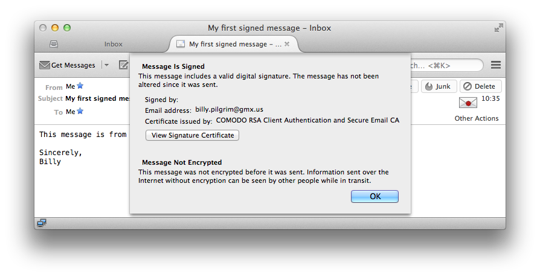

# Step-by-step instructions

To obtain a certificate, you need to apply for one at a Certification Authority (CA).
There are many CAs to choose from, but the most convenient one for people in research & higher education in Europe is TERENA's Certificate Service (TCS).

https://tcs-personal-portal.terena.org/

"

## 1. Install a certificate using your browser.

You can automatically install a certificate using your browser by logging in to your home organisation (e.g. your university). Click "Login" and select the organisation where you want to authenticate. After succesful login, you will be redirected back to the portal. Attributes like your name and your email address will be disclosed to the TCS service so it knows what data to put in the certificate.

Your browser will be instructed to generate a new key pair. The private key will be stored on your computer, the public key will be sent to the CA, together with your name and email address, and combined in a certificate. The certificate will be available for download shortly after.

Use the following steps. Click "My Certificates":

Click "New Certificate":

Read the information in the linksif you haven't done so already, and click the checkbox if you agree:

There are severl ways in which you can generate a key pair. It is easiest to let your browser generate a key pair for you. Click "Next".

The data that will appear in your certificate are listed here. Click "Next".

Your browser is now generating key material and submits it to the CA for processing: 

After a little while, your certificate should be ready:

Click "Install to keystore" to download the certificate and store it into the key store:

You are done! Your certificate is ready for use.

## 2. Export the certificate from your browser to a file

Your certificate can be used from your browser. But to use if for signing email, it must be installed and configured in your mail client. Note that using your certificate with webmail systems like Hotmail or Google mail is not possible. This is because the mail is sent and received on a server instead of on your client. The servers will not have access to your private key for generating signatures or decrypting email.

To Export your certificate from your browser, proceed as follows:

In Firefox, open the list of certificates.

- on windows, go to `Tools` -> `Advanced` -> `Encryption`.
- on OSX, open `Preferences` | `Advanced` | `Certificates`.

Then click `View Certificates` | `Your certificates`.

Your certificate should be listed there. Select the certificate you want to export.

Click `Backup...` and enter a name to save it to disk.

If you have set a master password to protect credentials stored in Firefox, enter it so you can read them:

You will be asked for a backup password with which your private key is encrypted. 

Make sure this password is strong enough. Anyone who can access the file and can guess the password gets hold of your private key! The password quality meter will indicate how strong your password is.

You should now see an alert, stating that your certificate and private key is stored in a backup file:

You are done. You can exit Firefox, and start your mail client.

## 3. Import the certificate into your mail client

Let's assume you use Thunderbird as your mail client.

Open the Certificate Manager.

CLick `Import...` and navigate to the backup file you created in the previous step.

Enter the password you used when exporting your certificate.

You should get an alert that your keys and certificate we're imported:

Your certificate whould now be listed under `Your Certificates`:

View:

Details:

## 4. Configure your mail client to use your certificate

Open Account Settings

Click Security

Under `Digital Signing`, click `Select...` to open a selection box with your installed certificates

Select the certificate you want to use with your account. Click "yes" if you want to use the same certificate for encryption.

You may consider signing your email by default by selecting the checkbox.

All set! Let's try to sign an email...

## 5. Send yourself a signed e-mail

## 6. Send yourself an encrypted email

